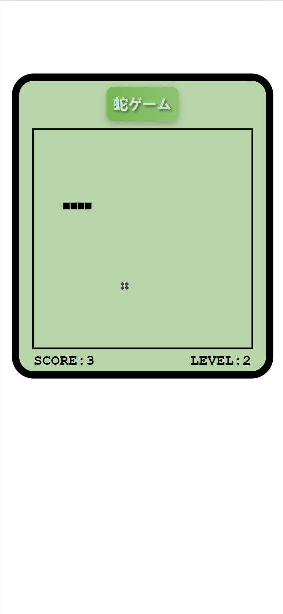

# TypeScript Learning and Snake Game Project

## Introduction

This repository documents my journey of learning TypeScript, culminating in the development of a classic Snake Game.

### Learning Process

- Basic Syntax and Types: Grasping the essentials of TypeScript's type system, including interfaces, enums, and type inference.
- Advanced Types and Functionalities: Diving deeper into generics, unions, intersections, and decorators.
- Real-world Application: Implementing TypeScript in practical scenarios, particularly in DOM manipulation and event handling.

## About the Project

This project is entirely developed in TypeScript, showcasing its potential in enhancing JavaScript projects with type safety and structured code.

### How to Play

1. Navigate to [Snake Game](https://lxinyu1999.github.io/SnakeGame).
2. Use the arrow keys to control the snake's direction.
3. Try to eat as many items as possible without colliding with the walls or the snake's body.
   
